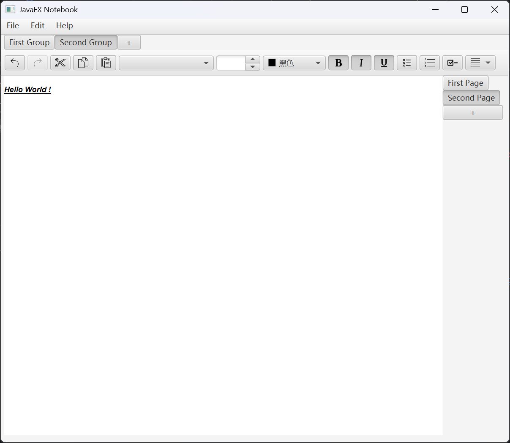

# NotebookApplication

A OneNote-like notebook application built with JavaFX 24.



---

## Features

### Done

- [x] OneNote-style note groups and pages (add, remove, rename, navigate)
- [x] Manual save and load to local `.dat` file (Java serialization)
- [x] Auto-save on exit, autoload on startup, plus manual save/load with shortcuts Ctrl+S/Ctrl+L
- [x] Undo / Redo for group and page operations (Command design pattern) with shortcuts Ctrl+Shift+Z/Ctrl+Shift+Y
- [x] Unit tests for the model and command layer
- [x] Better "About" dialogue content (author, repository link, licence)

### Roadmap

- [x] Import / Export notebook data from / to other directories
- [x] Text-level undo/redo — migrate from `HTMLEditor` to `RichTextFX`
- [x] Wire text editing toolbar: bold, italic, underline
- [x] Wire cut / copy / paste toolbar buttons
- [ ] Wire font family and font size selectors
- [ ] Wire text colour picker
- [ ] Wire bullet points, numbered lists, and checkboxes
- [ ] Wire text alignment (left, centre, right)
- [ ] Handle paragraph-level styling (indentation, spacing)
- [ ] Better UI design (e.g. Material UI styling)

---

## Architecture

```
notebookapplication/
├── model/       NoteFacade, NoteGroup, NotePage, NoteSubject
├── gui/         Controller, GroupBar, PageBar, MainFrame
└── command/     Command, UndoRedo, AddGroupCommand, …
```

- **Observer pattern** — model classes extend `NoteSubject`
  (`PropertyChangeSupport`); GUI components implement
  `PropertyChangeListener` for automatic UI synchronisation when
  the model changes.
- **Command pattern** — every mutating operation (create/remove
  group, create/remove page) is a `Command` object executed
  through an `UndoRedo` manager with two stacks. Navigation
  (switching groups/pages) is not undoable.
- **Facade pattern** — `NoteFacade` is the single entry point to
  the model layer; the GUI never touches `NoteGroup` or
  `NotePage` internals directly.

---

## Tech Stack

| Component                    | Version                            |
|------------------------------|------------------------------------|
| JavaFX (controls, fxml, web) | 24                                 |
| JDK                          | 24                                 |
| Maven                        | 3.x                                |
| RichTextFX                   | 0.11.5                             |
| JUnit Jupiter                | 5.10.3                             |
| Checkstyle                   | Google Checks                      |

---

## Getting Started

Clone or download the source code from the
[latest release](https://github.com/EvatsugDnalloR/NotebookApplication/releases/latest),
then build and run with Maven:

```bash
git clone https://github.com/EvatsugDnalloR/NotebookApplication.git   # if not downloading from release page
cd NotebookApplication   # open the directory
mvn clean javafx:run
```

Prerequisites: JDK 24 and Maven 3.x.

---
## High-Level Design

[UML Diagrams >>](uml_diagrams/diagrams.md)
