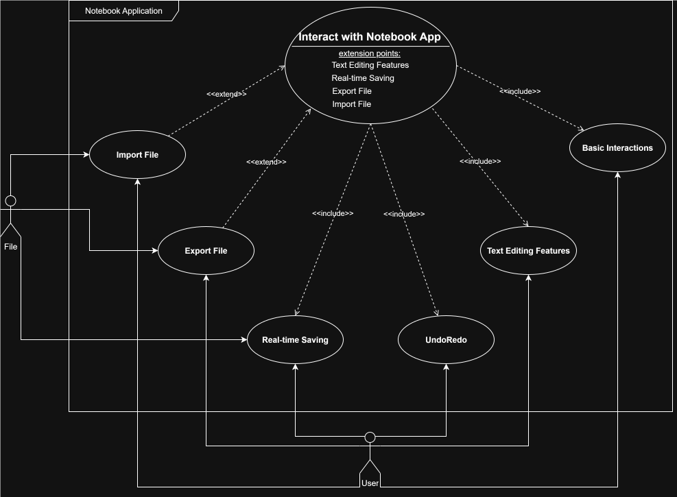
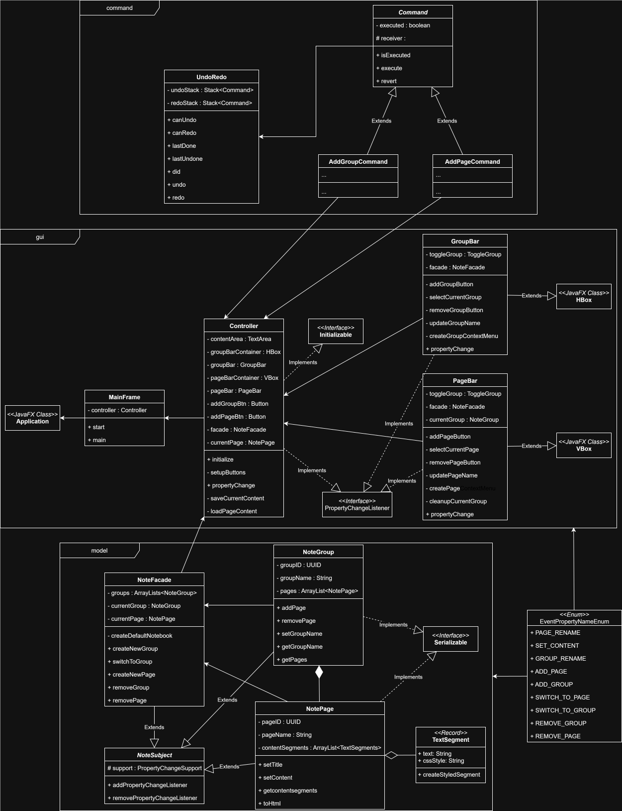

# NotebookApplication
A OneNote-like notebook application using javafx as GUI framework.

## Overview
- Managing note pages within note groups just like OneNote
- Basic text editing features such as modifying color, fonts, size of the texts in a note page
- Import and Export of note files with encryption
- File-saving on closing the app
- Unit tests for functions in the `notebookapplication.model` pacakge

## Design
### Use Case Diagram

### Use Case Lists
[Use Case Lists >>](uml_diagrams/use_case_list.md)

### Activity Diagrams
[Activity Diagrams >>](uml_diagrams/activity_diagrams.md)

### Class Diagram

## Features ToDo List
- [x] Basic text input management (with UndoRedo) and OneNote-like NoteGroup-NotePage management
- [ ] Basic text editing features (color, fonts, size etc.)
- [ ] Completed basic UI, including toolbar, menubar etc.
- [ ] Advanced text grouping feature (e.g. adding a checkbox in front of a paragraph, 
and this paragrah should now be grouped by this checkbox, just as in OneNote)
- [ ] Better UI design (e.g. applying Material UI in JavaFX)