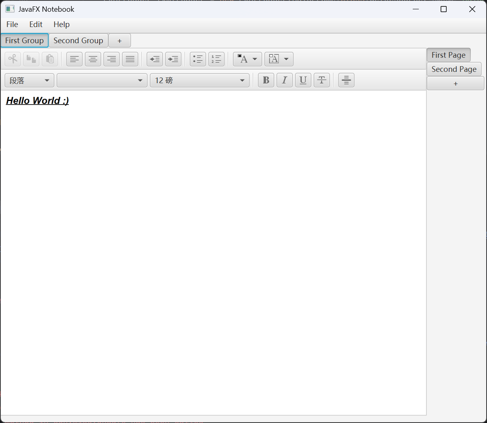

# NotebookApplication

A OneNote-like notebook application built with JavaFX 24.



---

## Features

### Done

- [x] OneNote-style note groups and pages (add, remove, rename, navigate)
- [x] Rich text editing (bold, italic, underline, fonts,
  colours, sizes etc.) and advanced text grouping (bullet points, checkboxes, indentation)
  via `HTMLEditor`
- [x] Manual save and load to local `.dat` file (Java serialization)
- [x] Auto-save on exit, autoload on startup, plus manual save/load with shortcuts Ctrl+S/Ctrl+L
- [x] Undo / Redo for group and page operations (Command design pattern) with shortcuts Ctrl+Shift+Z/Ctrl+Shift+Y
- [x] Unit tests for the model and command layer
- [x] Better "About" dialogue content (author, repository link, licence)

### Roadmap

- [ ] Import / Export to other file formats
- [ ] Text-level undo/redo — migrate from `HTMLEditor` to `RichTextFX`
- [ ] Better UI design (e.g. Material UI styling)

---

## Architecture

```
notebookapplication/
├── model/       NoteFacade, NoteGroup, NotePage, NoteSubject
├── gui/         Controller, GroupBar, PageBar, MainFrame
└── command/     Command, UndoRedo, AddGroupCommand, …
```

- **Observer pattern** — model classes extend `NoteSubject`
  (`PropertyChangeSupport`); GUI components implement
  `PropertyChangeListener` for automatic UI synchronisation when
  the model changes.
- **Command pattern** — every mutating operation (create/remove
  group, create/remove page) is a `Command` object executed
  through an `UndoRedo` manager with two stacks. Navigation
  (switching groups/pages) is not undoable.
- **Facade pattern** — `NoteFacade` is the single entry point to
  the model layer; the GUI never touches `NoteGroup` or
  `NotePage` internals directly.

---

## Tech Stack

| Component                    | Version                              |
|------------------------------|--------------------------------------|
| JavaFX (controls, fxml, web) | 24                                   |
| JDK                          | 24                                   |
| Maven                        | 3.x                                  |
| HTMLEditor                   | WebKit-based rich text               |
| RichTextFX                   | 0.11.5 (planned: replace HTMLEditor) |
| JUnit Jupiter                | 5.10.3                               |
| Checkstyle                   | Google Checks                        |

---

## Getting Started

There are two ways to run NotebookApplication:

### Option 1: Build from source

Clone the repository and run with Maven:

```bash
git clone https://github.com/EvatsugDnalloR/NotebookApplication.git
cd NotebookApplication
mvn clean javafx:run
```

Prerequisites: JDK 24 and Maven 3.x.

### Option 2: Portable version (no install required)

Download `NotebookApplication-v1.0.0-portable.zip` from the
[latest release](https://github.com/evatsug/NotebookApplication/releases/latest),
unzip it anywhere, and add its `bin` directory to your system `PATH`.
Then run:

```bash
app
```

The portable bundle includes a stripped JDK 24 runtime — no
separate Java installation is needed.

---
## High-Level Design

[UML Diagrams >>](uml_diagrams/diagrams.md)
